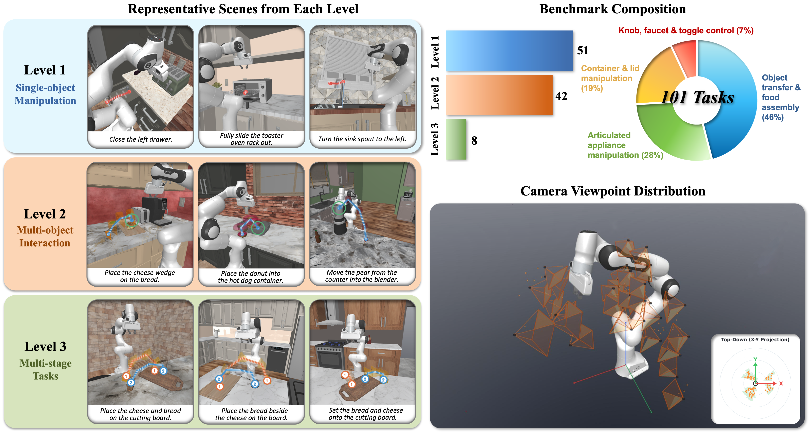

<div align="center">

# Dream.exe: Can Video Generation Models Dream Executable Robot Manipulation?

**Rui Zhao**<sup>1,\*</sup>, **Kaiming Yang**<sup>1,\*</sup>, **Jifeng Zhu**<sup>1,†</sup>, **Siyang Chen**<sup>1,†</sup>, **Ziqi Wang**<sup>1</sup>, **Weijia Wu**<sup>1</sup>, **Kevin Qinghong Lin**<sup>2</sup>, **Heng Wang**<sup>3</sup>, **Mike Zheng Shou**<sup>1,‡</sup>

<sup>1</sup>Show Lab, National University of Singapore &nbsp; <sup>2</sup>University of Oxford &nbsp; <sup>3</sup>Tencent

<sub><sup>\*</sup>Equal contribution &nbsp; <sup>†</sup>Equal contribution (second authors) &nbsp; <sup>‡</sup>Corresponding author</sub>

[](https://arxiv.org/abs/2606.04811)
[](https://huggingface.co/datasets/kaimingyang/Dream.exe)
[](https://huggingface.co/kaimingyang/DVD_for_Dream.exe)
[](LICENSE)
[](pyproject.toml)

</div>

> Turn a generated manipulation video into a 3D robot trajectory, execute it
> in simulation, and measure whether the imagined task actually works.

## ✨ Highlights

- 🎬 **Video → trajectory → execution.** One reproducible pipeline from a
  generated video to robot action and task-success evaluation.
- 🧪 **101 frozen tasks.** Curated RoboCasa scenes with fixed state, camera,
  first-frame generation input, protocol, and ground-truth references.
- 🤖 **Model-agnostic evaluation.** Import one video or a complete model batch
  without changing benchmark data or pipeline code.
- 🔌 **Replaceable model backends.** Swap the video generator, VLM judge,
  detector, segmenter, tracker, depth model, or pose model without changing the
  benchmark pipeline.
- 📦 **Reproducible release.** Relative-path workspace configuration, pinned
  providers, reviewed dependency patches, immutable inputs, and exact resume.

## 🗞️ News

- **2026-09** — Code release: publication in progress.
- **2026-09** — Benchmark and fine-tuned depth model release: upload in progress.
- **2026-06** — Accepted as a **Spotlight** at the ICML 2026 FoGen Workshop. 🎉

## 🧪 Benchmark task suite

<div align="center">
  
</div>

The 101 tasks cover single-object manipulation, multi-object interaction, and
long-horizon multi-stage tasks. Generated videos are evaluation subjects;
execution videos, extracted trajectories, actions, and metrics are stored only
as experiment outputs. Ground-truth video/action/depth remain immutable
references in the benchmark.

## 🚀 Get started

Getting started has two deliberately separate steps: install everything needed
once, then run one benchmark case that is already in the repository. The full
101-case benchmark is not needed for this path.

### 1. Install once

Follow **[INSTALL.md](INSTALL.md)** from top to bottom. It installs the main
Conda environment, the default execution providers, the required public model
assets, and the Dream.exe DVD checkpoint used by the bundled case. The guide
also separates these requirements from full-benchmark data and optional models.

The default depth model is our DVD LoRA fine-tuned on Dream.exe benchmark data.
The installation downloads only the bundled case's checkpoint, alongside the
required shared model dependencies.

The case data and released Kling 3.0 input video are already included through
Git LFS. You do not edit a workspace or download the full benchmark before the
first run.

### 2. Run the bundled case

From the repository root, run one command:

```bash
dream-exe run \
  --workspace examples/quickstart/workspace.json \
  --spec examples/quickstart/run.json
```

This executes `video2traj → action → simulation → evaluation` for
`rc_cheesybread_ep000001 / Kling3.0 / standard`. A successful run prints a
completed run report and writes only below `.dream-exe/quickstart/`; the bundled
benchmark inputs remain unchanged.

If the command stops during preflight, use `dream-exe doctor --workspace
examples/quickstart/workspace.json --case rc_cheesybread_ep000001` to identify a
missing provider, checkpoint, or Git LFS file. The
**[bundled-case guide](examples/quickstart/README.md)** explains the output tree,
the three-input comparison, saved metrics, and troubleshooting.

## 🧭 Choose your next goal

The following paths are alternatives after the bundled case; they are not a
single sequence that every user must complete.

| Goal | Additional requirement | Continue with |
|---|---|---|
| Run one or all 101 benchmark cases | Download the full benchmark data; add released result inputs only for exact reproduction | **[Benchmark and reproduction](docs/BENCHMARK.md)** |
| Evaluate videos from my generator or WAM | Use the included Wan2.2 adapter, import MP4s, or connect a hosted/local generator; preprocessing is automatic | **[Video models and WAMs](docs/VIDEO_MODELS.md)** |
| Evaluate saved outputs | A completed run; VLM scoring additionally needs local credentials | **[Evaluation](docs/EVALUATION.md)** and **[VLM example](examples/quickstart/VLM.md)** |
| Select official DVD, a Dream.exe LoRA, or another model | Install only assets not already required, then select the model explicitly | **[Model choices](docs/MODEL_ASSETS.md)** and **[custom backends](docs/CUSTOM_MODELS.md)** |
| Understand or modify the implementation | No additional data | **[Code structure and reading paths](docs/CODE_STRUCTURE.md)** |

## 🗂️ Configuration at a glance

Each file answers one question. Detailed keys and ownership rules live in the
**[configuration reference](docs/CONFIGURATION.md)**.

| File | Question it answers |
|---|---|
| `workspace.json` | Where are benchmark inputs, published results, providers, checkpoints, work, and outputs? |
| `run.json` | Which cases, input videos, stages, seed, and destination should this experiment run? |
| `credentials.local.json` | Which private endpoint and API key should VLM evaluation use? |
| `models.json` | Which caller-provided model implementations are available? |
| `runtime.json` | Which optional `exec` implementations should replace the defaults for this run? |

The bundled case uses its shipped workspace and run spec unchanged. Downloaded
benchmark protocol files are immutable reproduction inputs, not user
configuration.

## 📌 Citation

```bibtex
@article{zhao2026dreamexe,
  title   = {Dream.exe: Can Video Generation Models Dream Executable Robot Manipulation?},
  author  = {Zhao, Rui and Yang, Kaiming and Zhu, Jifeng and Chen, Siyang and Wang, Ziqi and Wu, Weijia and Lin, Kevin Qinghong and Wang, Heng and Shou, Mike Zheng},
  journal = {arXiv preprint arXiv:2606.04811},
  year    = {2026}
}
```

## 📄 License

Dream.exe is released under the [Apache 2.0 License](LICENSE). Benchmark assets,
external providers, and model checkpoints may have separate terms; review
[THIRD_PARTY.md](THIRD_PARTY.md) before redistribution.
